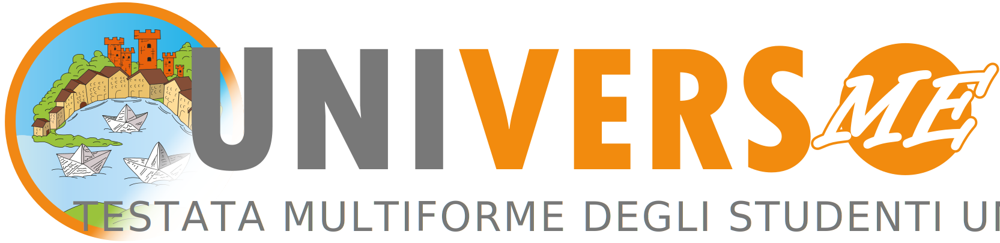

# UniVersoMe - Sito Web Ufficiale

  

## Descrizione del Progetto

Il sito web di **UniVersoMe** è la piattaforma online ufficiale della testata multimediale dell'**Università degli Studi di Messina**, uno spazio dedicato alla produzione giornalistica studentesca. Creato con l'obiettivo di offrire un punto di riferimento per l'informazione universitaria, il sito pubblica articoli redatti dagli studenti di vari Dipartimenti e Corsi di Studio dell'ateneo.

Oltre agli articoli, UniVersoMe comprende anche **RadioUVM**, la web radio ufficiale dell'Università; quest'ultima supporta e amplifica l'attività giornalistica con programmi di musica, intrattenimento e approfondimento culturale.

## Sviluppatori

Il sito è stato sviluppato sulla piattaforma **WordPress** durante l'anno accademico 2023-2024 dai seguenti studenti facenti parte della **Unit Informatica**:
- **Sandi Russo***
- **Alessandro Guarnera**
- **Danil Parrello**
- **Filippo Filloramo**

## Tecnologie Utilizzate

- **Apache**: Server web utilizzato per ospitare e distribuire il sito agli utenti finali.
- **WordPress**: Il Content Management System (CMS) utilizzato per gestire e pubblicare i contenuti del sito in modo efficiente e intuitivo.
- **HTML5/CSS3**: Linguaggi di markup e di stile usati per strutturare e personalizzare il design del sito.
- **PHP**: Il linguaggio di programmazione lato server alla base del core di WordPress, utilizzato per gestire la logica del sito e l'integrazione con il database.
- **PHP OPcache**: Libreria PHP usata per migliorare le performance della cache. OPcache riduce i tempi di caricamento delle pagine memorizzando bytecode precompilato, consentendo una risposta più rapida da parte del server web.
- **JavaScript**: Utilizzato per migliorare l'interattività del sito, gestendo funzionalità dinamiche come animazioni, aggiornamento in tempo reale dei contenuti e miglioramento dell'esperienza utente.
- **Swiper.js**: Libreria JavaScript esterna utilizzata per la creazione e la gestione di caroselli responsive e touch-friendly, usata in diverse sezioni del sito per presentare contenuti in modo visivamente accattivante e intuitivo.
- **MySQL**: Database relazionale utilizzato da WordPress per la memorizzazione e la gestione dei dati del sito, inclusi articoli, utenti e impostazioni.
- **AzuraCast**: Piattaforma utilizzata per la gestione completa delle funzioni di streaming e broadcast radiofonico di Radio UniVersoMe. Fornisce un'interfaccia per gestire playlist, trasmissioni live e automatizzate.

## Tema e Personalizzazione

Il tema utilizzato per UniVersoMe è stato personalizzato per rispecchiare la **grafica** e l'**identità** dell'Università degli Studi di Messina. Esso include modifiche al layout, alla tipografia e agli stili CSS per garantire una navigazione intuitiva e coerente con lo stile della testata multimediale. 

Tutti i file del tema sono contenuti nella directory apposita e possono essere ulteriormente personalizzati tramite modifiche ai template PHP e ai fogli di stile CSS.

## Struttura del Sito

Il sito di UniVersoMe è organizzato in modo da facilitare la navigazione e l'accesso rapido ai contenuti. Le diverse sezioni coprono una vasta gamma di argomenti e interessi, garantendo una fruizione completa e ben strutturata dell’informazione offerta dalla testata giornalistica e dalla radio.

Le principali sezioni del sito sono:

- **Home**: La pagina principale, dove vengono presentati gli articoli e le notizie più recenti.
- **Attualità**: Sezione dedicata alle notizie di interesse generale, con un focus su eventi nazionali e internazionali.
- **Cultura**: Spazio riservato ad articoli su arte, letteratura, cinema, teatro e altre espressioni culturali.
- **Eventi**: Una raccolta di articoli e reportage sugli eventi organizzati dall’Università e altri appuntamenti rilevanti.
- **Inchiostro**: Sezione dedicata alla creatività, dove vengono pubblicati poesie, racconti e opere letterarie degli studenti.
- **Ipse Dixit**: Raccolta di interviste e citazioni significative da personaggi rilevanti in diversi campi.
- **Recensioni**: Sezione dedicata a recensioni di libri, film, spettacoli teatrali e altri prodotti culturali.
- **Scienza & Salute**: Articoli che trattano di ricerca scientifica, innovazione tecnologica e temi legati alla salute e al benessere.
- **Vita Universitaria**: Spazio dedicato a notizie, approfondimenti e storie legate alla comunità studentesca e alla vita nell'ateneo.
- **Chi Siamo**: Una panoramica sulla redazione, la missione e i contatti del team di UniVersoMe.
## In Continua Evoluzione

Il sito di UniVersoMe è in **costante sviluppo** per garantire una piattaforma sempre aggiornata, fluida e moderna. Il team di sviluppo si impegna a implementare nuove funzionalità e miglioramenti che ottimizzano l'esperienza utente, mantenendo il sito sempre al passo con le tecnologie più recenti.

Gli aggiornamenti hanno l'obiettivo di:
- **Migliorare la fruibilità**, garantendo una navigazione intuitiva e accessibile su tutti i dispositivi.
- **Ottimizzare le performance** per assicurare tempi di caricamento rapidi e un'esperienza utente senza interruzioni.
- **Rendere l’esperienza sempre piacevole**, attraverso un design attuale e funzionalità pensate per semplificare l’interazione con i contenuti.

Questo approccio assicura che UniVersoMe rimanga una piattaforma all’**avanguardia**, offrendo un'esperienza piacevole e immersiva sia per i lettori che per la redazione.

## Contatti

Per segnalazioni tecniche o richieste di supporto, contattare il team di sviluppo:
- **Sandi Russo***: [sandi.russo@studenti.unime.it](mailto:sandi.russo@studenti.unime.it)
- **Alessandro Guarnera**: [alessandro.guarnera@studenti.unime.it](mailto:alessandro.guarnera@studenti.unime.it)
- **Danil Parrello**: [danil.parrello@studenti.unime.it](mailto:danil.parrello@studenti.unime.it)
- **Filippo FIlloramo**: [filippo.filloramo@studenti.unime.it](mailto:filippo.filloramo@studenti.unime.it)

***

_* referente della unit informatica_

***

[**UniVersoMe**](https://universome.unime.it/) - La voce degli studenti dell’Università di Messina.

